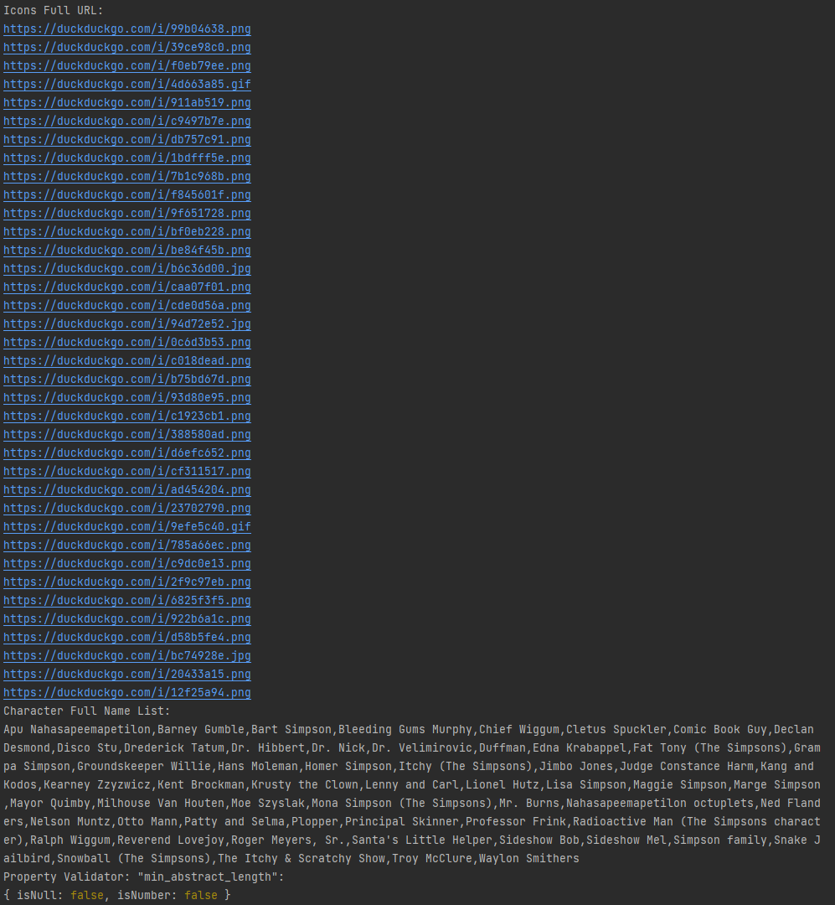

# **QA Automation Engineer Challenge**

## GENERAL INFO

Use the following API endpoint for each test case.
 https://api.duckduckgo.com/?q=simpsons%20characters&format=json&pretty=1

### CHALLENGE #1
1. Write a function that prints out the URL value associated to each “Icon” within “RelatedTopics”.

        Partial Example of the expected output:
            https://duckduckgo.com/i/1bdfff5e.png
            https://duckduckgo.com/i/7b1c968b.png
            https://duckduckgo.com/i/f845601f.png

### CHALLENGE #2
2. Print the name of each character from the result set in a comma separated list

        Partial Example of the expected output:
            Barney Gumble, Bart Simpson, Grampa Simpson, etc.

### CHALLENGE #3
3. Assert the items listed below are true for value of "min_abstract_length":  
    * Condition 1: Not null
    * Condition 2: Is an number
   
## RESULT:
